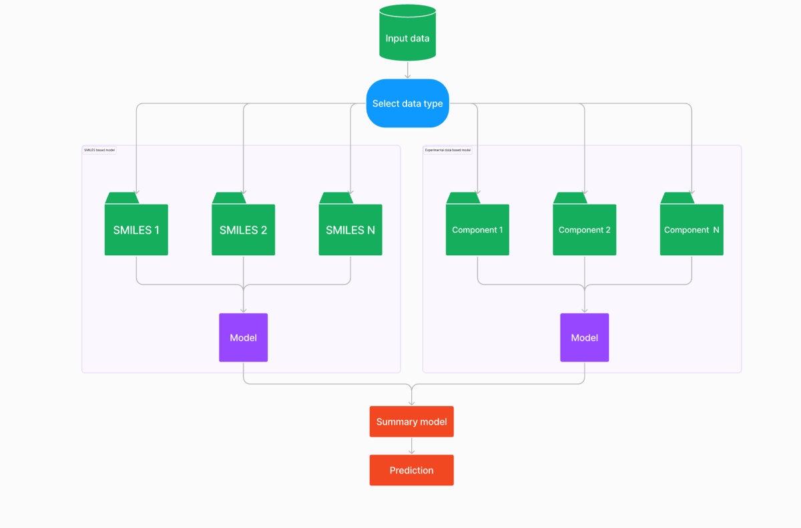

# OilCode Hack 2024
## Постановка задачи

Разработать модель, предсказывающую исследуемый параметр масла на основе
представленных открытых и приватных обезличенных данных. Модель должна работать
как при подаче только **нескольких SMILES** (как компонентов), так и при подаче
**параметров, похожих на свойства компонентов**, как в приватных обезличенных
данных (модель должна сама восполнить пропуски в них, если они будут).

Примерный план для решения задачи:
1. Проанализировать данные
2. Проанализировать публикации
   1. Увеличить размер выборки
3. Рассмотреть способы преобразования SMILES в машиночитаемый вид
   1. Подумать над возможностью использования графовых нейронных сетей
   2. Подумать над возможностью использования трансформеров
   3. **?** Подумать над возможностью использования квантово-химических дескрипторов
4. Разработать 1 часть модели, способную предсказывать необходимый
   **параметр по SMILES**.
   **!** Количество SMILES для одного масла может быть произвольным;
5. Разработать 2 часть модели, предсказывающую нужный параметр **по приватным** обезличенным данным.
   **!** При этом модель должна автоматически восполнять пропуски в данных, если
   таковые имеются.
6. Собрать обе части модели в конвейер, оптимизировать гиперпараметры
7. Оценить жизнеспособность модели на тестовых данных основными метриками
8. Подготовить инференс
9.  Подготовить презентацию вашего решения

Полученная модель после загрузки в систему будет оцениваться при помощи MAE. В
качестве приватной выборки будут использоваться экспериментальные данные, не
предоставленные участникам для хакатона. Целевая переменная будет находится в
столбце `oil_property_param_value` с совпаданием UUID в столбце
`oil_property_param_title - ad7e6027-00b8-4c27-918c-d1561f949ad8`.

- `oil_property_param_title` – название свойства каждого смазочного масла;
- `oil_property_param_value` – значение свойства каждого смазочного масла;

## Образ финального решения
Образ финального решения состоит из модели, способной предсказывать исследуемый
параметр смазочного масла **с произвольным** количеством компонентов, как для
компонентов **представленных с помощью SMILES**, так и для известных компонентов
**представленных экспериментальными параметрами из приватного обезличенного
датасета**. На рисунке представлен примерный образ финального решения.

## Загрузка решений
Загрузка решений будет осуществляться через платформу. Решение
необходимо упаковать в zip архив. Zip архив должен содержать код модели и
её инференс (ipynb или скрипт), а также ответы к предоставленным
тестовым данным в формате файла csv, сохраняя последовательность.
При загрузке архива csv файл с ответами вашего решения будет
сверяться с правильными ответами и высчитываться MAE. Полученная ошибка будет
использоваться при ранжировании лидерборда.