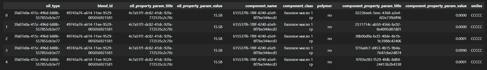
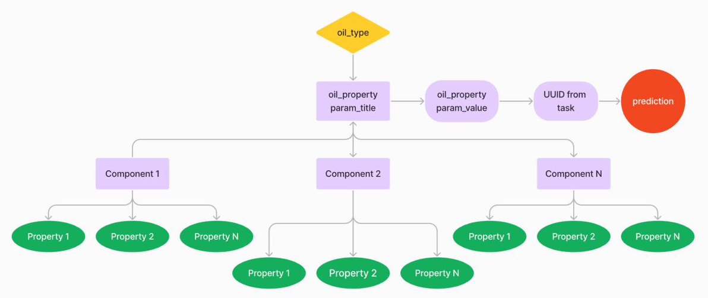

## Приватные данные

В таблице представлен набор масел и их свойства. Одно из свойств требуется
предсказать. Под UUID скрыты типы масел, свойства масел, свойства каждого
компонента. Каждому UUID соответствует определенное название, поэтому с помощью
них можно выделить каждое масло/компонент или их свойство.

Для каждого масла представлены компоненты, для каждого компонента – свойства. Эти свойства могут быть использованы в составе обучающей выборки.

- `blend_id` – идентификатор масла;
- `oil_type` – тип смазочного масла;
- `oil_property_param_title` – название свойства каждого смазочного масла;
- `oil_property_param_value` – значение свойства каждого смазочного масла;
- `component_name` – название компонента смазочного масла;
- `component_type_title` – тип компонента смазочного масла;
- `component_property_param_title` – название свойства компонента смазочного масла;
- `component_property_param_value` – значение свойства компонента смазочного масла.
--------------------------------------------------------------------------------------

На рисунке изображена схема распределения данных.
Зеленым отмечены признаки, которые можно использовать для обучения,
красным – признак, который нужно предсказать.

**Представленные данные имеют пропуски**, от которых можно избавиться
любым доступным способом. Однако не рекомендуется использовать
исключительно восстановленные данные для обучения, а изначально полные
данные для валидации, так как модель может себя неправильно повести на
скрытой выборке.